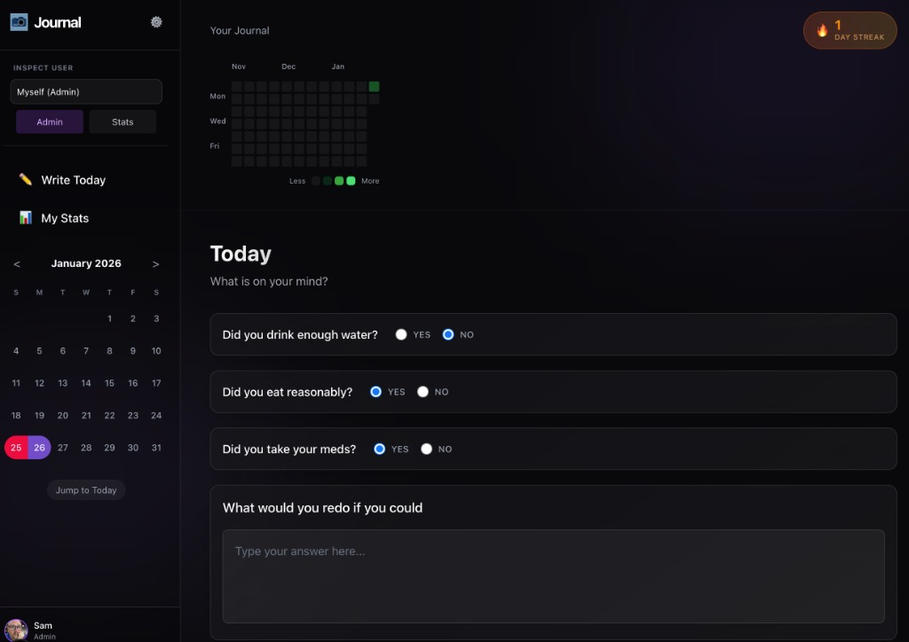

# Journaling App 📓

A focused, intelligent journaling application designed to help you de-clutter your mind and track your personal growth through daily reflection.




## ✨ Key Features

### 🧠 Smart Dashboard
- **Dynamic Prompts**: Admin-configurable questions that can be Text, Checkboxes, or Radio buttons.
- **Timezone Aware**: "Today" is calculated based on *your* local time, ensuring your streaks are accurate no matter where you travel.
- **Daily Context**: Tracks your habits alongside your thoughts.

### 📊 Deep Analytics
- **Contribution Heatmap**: Customizable GitHub-style history (12-week view on Dashboard, 46-week view on Stats).
- **Word Cloud**: Visual representation of your most frequent themes.
- **Time of Day**: See if you are an "Early Bird" or a "Night Owl".

### ❤️ Feedback Loop
- **Admin Hearts**: Admins can "Like" entries to provide subtle encouragement.
- **Visual Indicators**: Users see a red bubble on their calendar and a heart on their entry when feedback is received.

### 🛡️ Data Sovereignty
- **Full Backup (Admin)**: Exports the entire system state (including binary assets) to a secure `.json.gz` file.
- **Smart Restore (Admin)**: Restore functionality with "Merge" (safe) or "Overwrite" modes.
- **Personal Export (User)**: Users can download their own journal history as a portable JSON file from the Settings page.
- **Binary Handling**: Automatically reconstructs avatar and logo files from the backup.

### 🛠️ Admin & Configuration
- **User Management**: Admin role can view stats for other users, **monitor last activity**, and perform **Safe Deletion** (transactional removal of users with mandatory data backup).
- **Branding**: Customize the Site Name and Logo via the Admin Panel.
- **Prompt Rules**: Assign specific prompts to specific User Groups (e.g., "Athletes" get different questions than "Artists").
- **Profile Customization**: Users can upload avatars and manage their bio.

## 🏗️ Technology Stack

- **Framework**: Next.js 16 (App Router)
- **Language**: TypeScript
- **Database**: SQLite (via Prisma ORM)
- **Styling**: TailwindCSS & Custom "Glassmorphism" Utilities
- **Auth**: NextAuth.js (Auth.js)

## 🚀 Getting Started

1.  **Clone the repository:**
    ```bash
    git clone https://github.com/wilsyn-git/journal-app.git
    cd journal-app
    ```

2.  **Install dependencies:**
    ```bash
    npm install
    ```

3.  **Setup Database:**
    This project uses a local SQLite file. Initialize it with Prisma:
    ```bash
    npx prisma generate
    npx prisma db push
    # Optional: Seed initial data
    # npx prisma db seed
    ```

4.  **Run Development Server:**
    ```bash
    npm run dev
    # Or to restart cleanly:
    # npm run restart
    ```

5.  **Open Browser:**
    Navigate to [http://localhost:3000](http://localhost:3000).

## 🗃️ Project Structure

- `app/`: Next.js App Router pages and layouts.
- `components/`: Reusable UI components (Heatmaps, PromptCards, etc.).
- `lib/`: Utilities for Database (`prisma.ts`), Analytics (`analytics.ts`), & Timezones (`timezone.ts`).
- `prisma/`: Database schema and migrations.

## 🛣️ Roadmap

- [x] **AWS SES Integration**: Email infrastructure for password resets.
- [x] **Admin Feedback**: Heart/Like system for user entries.
- [x] **Data Export & Restore**: Full system backup and recovery.
- [x] **Branding**: Custom site identity.
- [ ] **Mobile Polish**: Responsiveness improvements for small screens.
- [ ] **Advanced Insights**: Sentiment analysis and mood tracking.

## 📄 License

MIT
